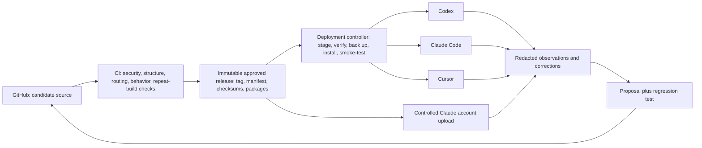

# Cross-client release and learning system

Status: proposed; local automation, GitHub Actions, and wider client deployment are not yet enabled.

## Decision

GitHub is the canonical source of truth, not a live-mounted skills folder. Clients consume immutable, commit-addressed release artifacts after validation, approval, installation, and surface-specific verification.

This separation is deliberate:

- `main` contains the best current candidate source, tests, contracts, and evidence.
- A release tag identifies an immutable candidate for deployment.
- A per-surface deployment record identifies what is actually installed and proven.
- Feedback creates proposed changes and regression cases; it never silently rewrites active instructions.

The repository therefore powers every client without allowing one bad edit, failed download, line-ending conversion, or misunderstood preference to corrupt all clients at once.

## System shape

## Release state machine

`draft -> candidate -> evaluated -> packaged -> canary -> approved -> active -> deprecated -> archived -> deleted`

Advancement is evidence-based. `active`, retirement, and deletion are user-owned decisions. A deployment can be rolled back without changing or rewriting Git history.

## Repository and GitHub setup

1. Keep `krishanraja/ai-harness` private and make it the only editable canonical copy.
2. Preserve repository text as LF using the committed `.gitattributes`; still deploy from deterministic archives because Git configuration and non-Git transports are client-specific.
3. Protect `main`. Require the harness validation check and the deterministic repeat-build check before merge. Do not permit a failed check to be bypassed for a production release.
4. Give GitHub Actions read-only repository permissions by default. Grant narrowly scoped release-write permission only to the release job.
5. Never put credentials, browser sessions, live customer data, or unredacted observations in Git. Use each client's credential store or environment and keep secret scanning enabled.
6. Tag approved releases as `harness-vYYYY.MM.DD.N`. Build from the exact clean tagged commit.
7. Publish these GitHub Release assets:
   - every deterministic `.skill` archive;
   - `release-<id>.json` containing source and artifact hashes;
   - a checksum file covering the manifest and all archives;
   - evaluation and security summaries that contain no secrets.
8. Prefer signed commits/tags and immutable releases. A changed skill is a new release, never an overwritten asset.

### Proposed CI gates

On every pull request and push to `main`:

1. Run `scripts/Test-Harness.ps1`.
2. Build twice into two fresh directories from the same commit.
3. Assert that every `.skill` filename and SHA-256 is identical across builds.
4. Run held-out trigger, routing, ambiguity, coexistence, and behavior suites.
5. Scan for credentials, unsafe filesystem scope, unapproved network calls, broken references, and duplicate skill names.
6. Publish the reports as workflow artifacts, but do not deploy.

On an explicitly approved release tag:

1. Repeat all gates on a clean runner.
2. package from the tag;
3. attach the immutable packages and evidence to a GitHub Release;
4. update no client directly.

The workflow should be added under `.github/workflows/` only after explicit approval because committing it enables new external automation on GitHub.

## Local update controller

Use one updater implementation with per-client adapters. It should poll the latest **approved release**, never raw `main`, and use this transaction:

1. Acquire a single-run lock.
2. Read the current per-surface deployment record.
3. Download the pinned release manifest and requested artifacts to a new staging directory.
4. Verify the release ID, source commit, validation status, package SHA-256, safe archive paths, and extracted full-directory SHA-256.
5. Refuse a downgrade, dirty package, unknown skill, missing dependency, unexpected existing target, or hash mismatch.
6. Preserve a byte-exact previous known-good copy and its deployment record.
7. Install by extracting the verified archive to a sibling temporary directory and then swapping the exact skill directory. Do not install from a Git checkout.
8. Verify the installed full-directory hash.
9. Start a fresh client task/session and run discovery, positive trigger, negative trigger, chained behavior, and coexistence smoke tests.
10. If any check fails, restore the prior copy and record the failure. Do not continue to the next surface.
11. If checks pass, record surface, skill, release, commit, hashes, test results, and timestamp.

The approved Codex canary proved why step 7 matters: a normal Windows Git checkout converted LF to CRLF, producing text-equivalent but byte-different files. Extracting the deterministic release package preserved the reviewed bytes exactly.

### Local surfaces

| Client | Detected user surface | Recommended controlled mode |
|---|---|---|
| Codex | `C:\Users\krish\.codex\skills` | Verified physical release extraction; validate in a new task |
| Claude Code | `C:\Users\krish\.claude\skills` | Verified physical release extraction; preserve existing junctions until individually reconciled |
| Cursor | `C:\Users\krish\.cursor\skills` | Treat as the primary canary target, then prove editor and CLI discovery |
| Cursor legacy/secondary | `C:\Users\krish\.cursor\skills-cursor` | Preserve and reconcile; do not keep as a second writable source |
| Shared agent library | `C:\Users\krish\.agents\skills` | Treat as a library/compatibility surface until each consuming client is proven |

Do not point all clients directly at the Git working tree. Client-specific caches, provider-managed skills, different discovery rules, and accidental local edits make that deceptively fragile. Physical release artifacts plus parity records give the same content with a real rollback boundary.

### Scheduling recommendation

After the updater passes manual canaries, run a read-only release check daily and a full drift audit weekly. Downloading and staging can be automatic. Replacement, first installation on a new surface, activation, deletion, and rollback-policy changes remain approval-gated until a stable history justifies narrowing those gates.

Use Windows Task Scheduler under Krish's normal account with a dedicated script path, least privilege, a single-instance lock, bounded runtime, and logs outside the skill directories. Do not store a GitHub token in the task command; use the authenticated GitHub CLI or Windows Credential Manager.

## Claude account: web and Desktop

Claude account skills are a separate deployment surface. Anthropic explicitly states that custom skills do not automatically synchronize between claude.ai, the API, and Claude Code. A GitHub release therefore cannot directly update the personal Claude skill catalog.

For the current personal-account setup, use this controlled bridge:

1. Select only skills approved for the Claude account bundle.
2. Download the exact GitHub Release artifacts and verify hashes locally.
3. Compare the account catalog against the deployment manifest by name, description, upload date, enabled state, and known release hash/record.
4. Upload through `Customize > Skills` in a supervised browser session.
5. Test the uploaded skill in a fresh Claude chat before enabling or replacing broader routes.
6. Record the cloud upload, state, and behavioral proof. The record is the parity evidence because the personal catalog does not expose a local filesystem hash.
7. Preserve the previous ZIP and do not delete the old entry until the replacement passes its observation window and deletion is explicitly approved.

The Claude Skills API can automate API/workspace-managed skills, but those API skills are not the same catalog as claude.ai. Browser automation can assist a supervised personal-account release, but it is too UI-dependent to be the unattended production updater.

## Self-correction and learning

“Self-learning” means a governed learning loop, not an agent editing its own active rules:

1. **Observe:** capture a task outcome, explicit correction, missed trigger, unnecessary trigger, contradiction, or repeated manual step.
2. **Classify:** distinguish durable personal preference, task-local choice, changing operational fact, tool defect, and one-off exception.
3. **Protect:** redact credentials, private customer data, and unnecessary conversation content before persistence.
4. **Propose:** direct user corrections may produce an immediate candidate change; implicit patterns require repeated evidence. Every proposal states affected skills, expected benefit, risks, and rollback.
5. **Test:** add or update a regression case first. Run isolation, coexistence, routing, behavior, and security checks.
6. **Review:** consequential identity, voice, taste, priority, business-goal, activation, and retirement changes require Krish's decision. Reversible technical maintenance may proceed inside previously granted authority.
7. **Release:** merge, tag, package, canary, observe, and promote through the same release system.

Never learn from a single unconfirmed inference, copy live operational facts into durable doctrine, optimize only for positive triggers, or let a client write directly to production skill directories.

## Freshness loop

- Each canonical skill has an owner, last-reviewed date, and freshness SLA in `state/skill-registry.yaml`.
- A weekly audit opens a proposal when an SLA expires, a dependency changes, a provider changes its format, an evaluation declines, or deployed hashes drift.
- Dynamic facts are fetched from their live authoritative source at task time; a recent `Last Updated` label cannot make copied facts authoritative.
- Re-run the complete suite after any model/client update that could affect discovery or instruction following.
- Review overlap and recall as the active set grows. More active skills can reduce correct selection, so bundles are routed by role/task instead of enabling everything everywhere.

## Existing skills and deletion policy

There is no mass-delete step. Every existing local or cloud artifact is classified independently as:

- retain as provider-managed;
- coexist because it owns a distinct route;
- replace with a proven canonical version;
- quarantine because it is unsafe or unproven;
- archive for rollback/history;
- delete after explicit approval.

A deletion proposal must name the exact artifact and surface, its replacement or reason for retirement, evidence that no unique behavior is lost, the backup location/hash, the rollback method, and the completed observation window. Disabling is preferred before deletion. Provider-managed caches are outside this migration.

## Rollout order

1. Finish the single `harness-maintainer` Codex canary in a new task: discovery, routing, behavior, and coexistence.
2. Add and approve CI validation/release workflows; publish one immutable no-deploy release.
3. Implement the local updater in audit/stage-only mode, then test rollback against disposable fixtures.
4. Canary the base chain on Codex: `krish-principles -> take-the-brief when warranted -> strategy-brief -> route owner -> verification-loop`.
5. Repeat one client at a time for Claude Code and Cursor.
6. Reconcile the Claude account catalog and upload only the approved Claude bundle.
7. Observe real use, resolve overlap, and only then propose exact disables, archives, or deletions.

## Current approval boundary

Approved: the one-skill Codex canary for `harness-maintainer` and its verification/rollback authority.

Not yet approved: GitHub Actions activation, Task Scheduler creation, wider local installation or replacement, directory relinking, Claude uploads or toggles, API deployment, and any deletion. These are separate gates, not implied by GitHub being the source of truth.

## Authoritative platform references

- Anthropic, Skills for enterprise: https://platform.claude.com/docs/en/agents-and-tools/agent-skills/enterprise
- Anthropic, Use skills in Claude: https://support.claude.com/en/articles/12512180-use-skills-in-claude
- Cursor, Agent Skills support: https://cursor.com/changelog/2-4
- GitHub, workflow artifacts: https://docs.github.com/en/actions/concepts/workflows-and-actions/workflow-artifacts
- GitHub, release and maintenance automation: https://docs.github.com/en/actions/how-tos/create-and-publish-actions/release-and-maintain-actions
