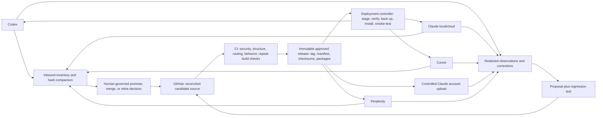

# Cross-client release and learning system

Status: `harness-v2026.09.08.2` is the latest immutable approved release. It is hash-verified on all three local client surfaces on the primary Windows machine. The intermittently mounted additional machine and cloud account catalogues remain separately supervised surfaces. GitHub remains the release authority only after reconciliation; no timestamp, client, or repository location wins automatically.

## Decision

GitHub is the canonical **release authority**, not an assumption that repository bytes are always newest. Any personalized surface may contain a legitimate later edit. Clients still consume immutable, commit-addressed release artifacts, but only after an inbound inventory and explicit reconciliation has promoted, merged, or retired every divergence.

This separation is deliberate:

- `main` contains the best **reconciled** candidate source, tests, contracts, and evidence.
- A release tag identifies an immutable candidate for deployment.
- A per-surface deployment record identifies what is actually installed and proven.
- Surface edits and feedback create preserved candidate changes and regression cases; they never silently rewrite active instructions or get silently erased by rollout.

The repository therefore powers every client without allowing either one bad edit to spread everywhere or one legitimate later edit to be wiped out by an older release.

## System shape

## Release state machine

`draft -> candidate -> evaluated -> packaged -> canary -> approved -> active -> deprecated -> archived -> deleted`

Advancement is evidence-based. `active`, retirement, and deletion are user-owned decisions. A deployment can be rolled back without changing or rewriting Git history.

## Repository and GitHub setup

1. Keep `krishanraja/ai-harness` private and make it the only repository allowed to produce an approved release. Surface edits remain preserved inbound candidates until reconciled here.
2. Preserve repository text as LF using the committed `.gitattributes`; still deploy from deterministic archives because Git configuration and non-Git transports are client-specific.
3. Protect `main`. Require the harness validation check and the deterministic repeat-build check before merge. Do not permit a failed check to be bypassed for a production release.
4. Give GitHub Actions read-only repository permissions by default. Grant narrowly scoped release-write permission only to the release job.
5. Never put credentials, browser sessions, live customer data, or unredacted observations in Git. Use each client's credential store or environment and keep secret scanning enabled.
6. Tag approved releases as `harness-vYYYY.MM.DD.N`. Build from the exact clean tagged commit.
7. Publish these GitHub Release assets:
   - every deterministic `.skill` archive for directory-based Agent Skills clients and Claude Cloud;
   - every deterministic `-perplexity.zip` archive with `SKILL.md` at the ZIP root;
   - `release-<id>.json` containing source and artifact hashes;
   - a checksum file covering the manifest and all archives;
   - evaluation and security summaries that contain no secrets.
8. Prefer signed commits/tags and immutable releases. A changed skill is a new release, never an overwritten asset.

### Proposed CI gates

On every pull request and push to `main`:

1. Run `scripts/Test-Harness.ps1`.
2. Build twice into two fresh directories from the same commit.
3. Assert that every `.skill` filename and SHA-256 is identical across builds.
4. Run held-out trigger, routing, ambiguity, coexistence, and behavior suites.
5. Scan for credentials, unsafe filesystem scope, unapproved network calls, broken references, and duplicate skill names.
6. Publish the reports as workflow artifacts, but do not deploy.

On an explicitly approved release tag:

1. Repeat all gates on a clean runner.
2. package from the tag;
3. attach the immutable packages and evidence to a GitHub Release;
4. update no client directly.

The approved workflows are stored under `.github/workflows/`. Validation runs on pull requests and `main`; release packaging runs only when an explicitly created `harness-vYYYY.MM.DD.N` tag is pushed.

## Local update controller

Use one updater implementation with per-client adapters. It should poll the latest **approved release**, never raw `main`, and use this transaction:

1. Acquire a single-run lock.
2. Hash the current surface and compare it with the current per-surface deployment record. Preserve every unknown divergence as an inbound candidate.
3. Require each divergence to be explicitly promoted, merged, or retired in a reconciliation record bound to the current hash, candidate release, source commit, and candidate hash.
4. Download the pinned release manifest and requested artifacts to a new staging directory.
5. Verify the release ID, source commit, validation status, package SHA-256, safe archive paths, and extracted full-directory SHA-256.
6. Refuse a downgrade, dirty package, unknown skill, missing dependency, unexpected existing target, hash mismatch, or unreconciled drift. A backup does not turn an unknown overwrite into an approved one.
7. Preserve a byte-exact previous known-good copy and its deployment record.
8. Install by extracting the verified archive to a sibling temporary directory and then swapping the exact skill directory. Do not install from a Git checkout.
9. Verify the installed full-directory hash.
10. Start a fresh client task/session and run discovery, positive trigger, negative trigger, chained behavior, and coexistence smoke tests.
11. If any check fails, restore the prior copy and record the failure. Do not continue to the next surface.
12. If checks pass, record surface, skill, release, commit, hashes, reconciliation decisions, test results, and timestamp.

The approved Codex canary proved why step 7 matters: a normal Windows Git checkout converted LF to CRLF, producing text-equivalent but byte-different files. Extracting the deterministic release package preserved the reviewed bytes exactly.

### Local surfaces

| Client | Detected user surface | Recommended controlled mode |
|---|---|---|
| Codex | `C:\Users\krish\.codex\skills` | Verified physical release extraction; validate in a new task |
| Claude Code | `C:\Users\krish\.claude\skills` | Verified physical release extraction; preserve existing junctions until individually reconciled |
| Cursor | `C:\Users\krish\.cursor\skills` | Treat as the primary canary target, then prove editor and CLI discovery |
| Cursor-managed catalog | `C:\Users\krish\.cursor\skills-cursor` | Provider-managed product assets with Cursor management manifests; exclude from canonical ownership and do not purge as user duplicates |
| Shared agent library | `C:\Users\krish\.agents\skills` | Third-party library only; canonical-name collisions are quarantined and the remaining catalog is demand-reviewed |

Do not point all clients directly at the Git working tree. Client-specific caches, provider-managed skills, different discovery rules, and accidental local edits make that deceptively fragile. Physical release artifacts plus parity records give the same content with a real rollback boundary.

### Multiple local machines

Treat every machine as a separately identified deployment and inbound-candidate surface. A remote machine may fetch an approved immutable release and may push preserved observations, hashes, tests, or a candidate branch, but its unattended schedule must never overwrite `main`, retag a release, or assume its local bytes are superior.

The central reconciler must fetch all remote branches and tags before building a candidate, compare each machine's complete normalized path/file-hash set with its last deployment record, and preserve changes that descend from neither baseline. If two machines changed the same skill, merge by source authority, behavior, and regression evidence; never by timestamp. Only a clean reconciled commit that passes the full release gates may become a new tag. Each machine then consumes that new release through its own backup, install, and canary record.
### Scheduling recommendation

Run a read-only inbound change sentinel daily and a full drift, freshness, dependency, and behavior audit weekly. The daily check inventories all available local and authenticated cloud surfaces, compares them with the last deployment records, and opens a preserved candidate when it sees novel bytes or observable cloud content. Downloading and staging can be automatic. Replacement, first installation on a new surface, activation, deletion, and rollback-policy changes remain approval-gated.

Every present or future harness-maintenance schedule must explicitly test complete supporting-file preservation, repeat-identical standard and Perplexity transport layouts, and paired-resource loading for routes that require multiple files. While the `ctrl-intake` voice route exists, its scheduled regression must prove that `leaves/voice.md` and `leaves/transcripts.md` load together and preserve authorization, withdrawal, exact-owner handoff, one-question behavior, and the required stop condition. Read the stored schedule prompt back after creation or revision; a generic freshness instruction does not satisfy this invariant.

Use Windows Task Scheduler under Krish's normal account with a dedicated script path, least privilege, a single-instance lock, bounded runtime, and logs outside the skill directories. Do not store a GitHub token in the task command; use the authenticated GitHub CLI or Windows Credential Manager.

## Claude account: web and Desktop

Claude account skills are a separate deployment surface. Anthropic explicitly states that custom skills do not automatically synchronize between claude.ai, the API, and Claude Code. A GitHub release therefore cannot directly update the personal Claude skill catalog.

For the current personal-account setup, use this controlled bridge:

1. Select only skills approved for the Claude account bundle.
2. Download the exact GitHub Release artifacts and verify hashes locally.
3. Compare the account catalog against the deployment manifest by name, description, upload date, enabled state, and known release hash/record.
4. Upload through `Customize > Skills` in a supervised browser session.
5. Test the uploaded skill in a fresh Claude chat before enabling or replacing broader routes.
6. Record the cloud upload, state, and behavioral proof. The record is the parity evidence because the personal catalog does not expose a local filesystem hash.
7. Preserve the previous ZIP and do not delete the old entry until the replacement passes its observation window and deletion is explicitly approved.

The Claude Skills API can automate API/workspace-managed skills, but those API skills are not the same catalog as claude.ai. Browser automation can assist a supervised personal-account release, but it is too UI-dependent to be the unattended production updater.

## Perplexity Computer: account-level web and desktop surface

Perplexity Computer custom skills are account-managed rather than a separate Windows skill directory. A verified upload in `Computer > Customize > Skills` is therefore the deployment for both the web surface and any signed-in Perplexity desktop client on the same account.

Use a controlled bridge:

1. Build Perplexity transport packages with `scripts/Build-HarnessRelease.ps1`; each `-perplexity.zip` places `SKILL.md` at the ZIP root while preserving every canonical skill file and reference.
2. Validate the canonical source, build twice, and require identical package hashes.
3. Inventory `My skills` before mutation and preserve provider example skills as provider-managed dependencies.
4. Upload no more than Perplexity's current UI batch limit, wait for each batch to finish, and verify the exact enabled name set after the final batch.
5. Run a fresh Computer task that proves discovery, reference loading, routing, behavior, and stopping conditions before claiming the surface active.
6. Record source commit, transport hashes, visible enabled state, canary evidence, retrieval time, and the residual absence of a downloadable cloud hash.

Perplexity's account-level upload is not a second release authority and is not a byte-parity claim. Its observable content may still be an inbound change candidate and must be preserved for review rather than overwritten by assumption. Do not create a fake local skills folder for the desktop app. Updates remain supervised until Perplexity exposes a stable authenticated API with equivalent inventory, upload, enabled-state, and rollback evidence.

## Portable supporting-file contract

Supporting files such as `references/*.md` and `leaves/*.md` are canonical skill resources, not client-specific source. `SKILL.md` must name the exact relative path and the condition that requires loading it. The validator rejects missing or Windows-style resource paths, the release builder preserves the complete directory in both transport forms, and repeat-build checks compare hashes for both forms.

Do not flatten a healthy multi-file skill merely because one provider uses different terminology. Progressive disclosure is the intended behavior. If a client fails a held-out resource-loading canary, keep the canonical multi-file source and add a deterministic client adapter or flattened fallback only for that proven limitation.

## Self-correction and learning

“Self-learning” means a governed learning loop, not an agent editing its own active rules:

1. **Observe:** capture a task outcome, explicit correction, missed trigger, unnecessary trigger, contradiction, or repeated manual step.
2. **Classify:** distinguish durable personal preference, task-local choice, changing operational fact, tool defect, and one-off exception.
3. **Protect:** redact credentials, private customer data, and unnecessary conversation content before persistence.
4. **Propose:** direct user corrections may produce an immediate candidate change; implicit patterns require repeated evidence. Every proposal states affected skills, expected benefit, risks, and rollback.
5. **Test:** add or update a regression case first. Run isolation, coexistence, routing, behavior, and security checks.
6. **Review:** consequential identity, voice, taste, priority, business-goal, activation, and retirement changes require Krish's decision. Reversible technical maintenance may proceed inside previously granted authority.
7. **Release:** merge, tag, package, canary, observe, and promote through the same release system.

Never learn from a single unconfirmed inference, copy live operational facts into durable doctrine, optimize only for positive triggers, or let a client write directly to production skill directories.

### Shared event inbox

Work surfaces do not run local collectors, scheduled scripts or n8n workflows.
When a surface can make an authenticated HTTPS request, it submits one strict,
redacted versioned envelope to Control Center's harness event endpoint. If a
client cannot make that request, the capability remains visibly unavailable on
that surface rather than being simulated through an unverified local process.

Supabase owns this raw append-only inbox because it is operational event state.
GitHub remains the only authority for harness doctrine. The nightly GitHub
observer reads the inbox through a separate read-only bearer, appends unseen
events to `state/observations/`, and advances a monotonic cursor. It never marks
an event applied and never writes a skill, contract, registry or rule.

The envelope contains only a stable event id, schema version, occurrence time,
surface family, event kind, short redacted summary, opaque evidence reference,
optional related skill or rule, outcome, severity and confidence. Unknown
fields, raw transcripts, oversized text, control characters and likely secret
shapes are rejected before persistence. Transport retries reuse the same event
id and return the original receipt. The exact version 1 contract is in
`architecture/HARNESS_EVENT_ENVELOPE.md`.

`n8n` is not part of this path. It may submit an event when an n8n-backed task
produces evidence, exactly like any other surface, but it does not ingest,
classify, schedule, propose or promote harness learning.

## Freshness loop

- Each canonical skill has an owner, last-reviewed date, and freshness SLA in `state/skill-registry.yaml`.
- A daily sentinel opens an inbound candidate when local hashes or observable cloud content differ from the last proven deployment; a weekly deep audit additionally opens a proposal when an SLA expires, a dependency changes, a provider changes its format, or an evaluation declines.
- Dynamic facts are fetched from their live authoritative source at task time; a recent `Last Updated` label cannot make copied facts authoritative.
- Re-run the complete suite after any model/client update that could affect discovery or instruction following.
- Review overlap and recall as the active set grows. More active skills can reduce correct selection, so bundles are routed by role/task instead of enabling everything everywhere.

## Existing skills and deletion policy

There is no mass-delete step. Every existing local or cloud artifact is classified independently as:

- retain as provider-managed;
- coexist because it owns a distinct route;
- replace with a proven canonical version;
- quarantine because it is unsafe or unproven;
- archive for rollback/history;
- delete after explicit approval.

A deletion proposal must name the exact artifact and surface, its replacement or reason for retirement, evidence that no unique behavior is lost, the backup location/hash, the rollback method, and the completed observation window. Disabling is preferred before deletion. Provider-managed caches are outside this migration.

## Rollout order

1. Finish the single `harness-maintainer` Codex canary in a new task: discovery, routing, behavior, and coexistence.
2. Add and approve CI validation/release workflows; publish one immutable no-deploy release.
3. Implement the local updater in audit/stage-only mode, then test rollback against disposable fixtures.
4. Canary the base chain on Codex: `krish-principles -> take-the-brief when warranted -> strategy-brief -> route owner -> verification-loop`.
5. Repeat one client at a time for Claude Code and Cursor.
6. Reconcile the Claude account catalog and upload only the approved Claude bundle.
7. Observe real use, resolve overlap, and only then propose exact disables, archives, or deletions.

## Current approval boundary

Approved by Krish on 2026-08-29 for this reconciliation: ingest the additional Codex machine's GitHub release evidence; preserve and reconcile Claude's newer source-backed changes; create and push a new immutable release after all gates pass; and deploy that verified release to every reachable local and authenticated cloud surface. The approval does not authorise permanent deletion, credential rotation, publication unrelated to the harness, or overwriting an unexplained divergence. Replaced local skill directories must remain recoverable through deployment backups; cloud deletion remains separately gated.

## Authoritative platform references

- Anthropic, Skills for enterprise: https://platform.claude.com/docs/en/agents-and-tools/agent-skills/enterprise
- Anthropic, Use skills in Claude: https://support.claude.com/en/articles/12512180-use-skills-in-claude
- Cursor, Agent Skills support: https://cursor.com/changelog/2-4
- GitHub, workflow artifacts: https://docs.github.com/en/actions/concepts/workflows-and-actions/workflow-artifacts
- GitHub, release and maintenance automation: https://docs.github.com/en/actions/how-tos/create-and-publish-actions/release-and-maintain-actions
